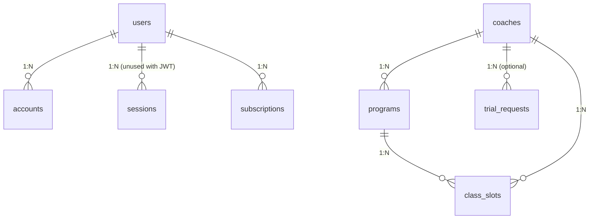

# IRONFORGE — Master Project Architecture Document (PAD) v1.0.0

**Classification:** Internal Engineering Reference
**Status:** DEFINITIVE, PRODUCTION-LOCKED BLUEPRINT
Companion Document: AGENTS.md, CLAUDE.md, README.md, fitness-studio_SKILL.md
**Last Updated:** 2026-07-03
**Audience:** Senior Engineers, Tech Leads, DevOps, Onboarding Engineers, AI Coding Agents
**Quality Gate:** 153/153 unit tests passing, 8 E2E spec files, 0 vulnerabilities, 24 routes built

**Rule:** Every architectural decision in this document traces to a specific rationale. Nothing is here "because it's popular."

---

## Table of Contents

1. [System Overview & Decisions](#1-system-overview--decisions)
2. [Technology Stack Summary](#2-technology-stack-summary)
3. [Architecture Decision Records (ADRs)](#3-architecture-decision-records-adrs)
4. [High-Level System Topology](#4-high-level-system-topology)
5. [Application Architecture](#5-application-architecture)
6. [Data Architecture](#6-data-architecture)
7. [Design System Reference](#7-design-system-reference)
8. [Security Architecture](#8-security-architecture)
9. [Worker / Background Service Architecture](#9-worker--background-service-architecture)
10. [Testing Strategy](#10-testing-strategy)
11. [Build & Deployment](#11-build--deployment)
12. [Developer Handbook](#12-developer-handbook)
13. [Known Issues & Outstanding Tasks](#13-known-issues--outstanding-tasks)
14. [Key Files Reference](#14-key-files-reference)
15. [Glossary](#15-glossary)

---

## 1. System Overview & Decisions

### 1.1 Document Metadata & Purpose

This PAD is the single source of truth for the IRONFORGE fitness studio platform. It captures not just what the system is, but why every decision was made and how every component fits together.

**How to use this document:**

- **New engineer onboarding:** Read §1 (Overview), §2 (Tech Stack), §5 (Architecture), §12 (Developer Handbook)
- **Debugging:** Consult §10 (Testing Strategy), §13 (Known Issues), §14 (Key Files Reference)
- **Architecture review:** Review §3 (ADRs), §4 (Topology), §5 (Layer Model), §6 (Data Architecture)
- **Security audit:** Read §8 (Security Architecture) in full
- **AI coding agent:** Read companion documents AGENTS.md + CLAUDE.md alongside this document

### 1.2 What IRONFORGE Is

IRONFORGE is a production-grade, high-end strength & conditioning studio website. It is a full-stack Next.js 16 marketing + booking + membership + admin platform with the following core features:

| Feature                | Description                                                                                          |
| ---------------------- | ---------------------------------------------------------------------------------------------------- |
| 🎬 Cinematic Hero Reel | 5-frame Ken Burns cross-fade with mute toggle, parallax, progress bar, marquee ticker                |
| 🏋️ Programs Grid       | 9 programs across 5 goal categories with pill-filter + staggered reveal                              |
| 🔄 Coach Flip Cards    | 3D Y-axis flip on hover/tap/keyboard — front: portrait + name; back: bio + certs + signature workout |
| 📖 Stories Carousel    | Drag-to-swipe with rubber-band physics, momentum, snap, auto-advance_abort, dots + prev/next         |
| 📅 Booking Flow        | Multi-field form with Zod validation, server action, Inngest job, rate limit, honeypot, toast        |
| 💳 Stripe Memberships  | 3 tiers (Forge / Forge+ / Forge Private) + drop-in pack with Checkout Sessions + webhook             |
| 🎨 AI Asset Generation | Replicate SDXL B&W noir prompt template → Cloudflare R2 storage with SVG fallback                    |
| 🔐 Auth + Admin        | Auth.js v5 Credentials + JWT, admin login, CRUD actions, role-gated layout, edge proxy               |
| 🌐 SEO                 | JSON-LD HealthClub schema, sitemap.xml, robots.txt, PWA manifest, OG/Twitter cards                   |
| ♿ WCAG AAA            | Skip link, focus-visible, reduced-motion, 44px touch targets, AA contrast, ARIA roles                |

### 1.3 Design Philosophy

**"FORGED IN IRON."** Editorial noir meets industrial telemetry. A brand site that looks like a private strength studio at 5:43 AM — dark, sweaty, focused, and unapologetically hardcore.

**Non-Negotiable Design Rules:**

1. **Pure black canvas** (`#0a0a0a`) — never use white or light backgrounds
2. **Single neon orange accent** (`#FF5400`) — rationed, the ONLY hue that asserts itself
3. **Metallic silver chrome** (`#C8C8C8`) — secondary CTA, equipment reference
4. **B&W noir photography** — `grayscale(100%) contrast(1.55) brightness(0.42)` on all images
5. **Bebas Neue display** at massive sizes (up to 14vw) for hero headlines only
6. **CSS-only animations** — no Framer Motion, no GSAP, no Lottie
7. **`prefers-reduced-motion` disables ALL motion** — not just slows

---

## 2. Technology Stack Summary

| Layer               | Technology                    | Version        | Purpose                                                         |
| ------------------- | ----------------------------- | -------------- | --------------------------------------------------------------- |
| **Framework**       | Next.js                       | 16.2.10        | App Router, Server Components, Turbopack                        |
| **UI Runtime**      | React                         | 19.2.7         | Strict mode, React Compiler                                     |
| **Language**        | TypeScript                    | 5.9.3          | Strict mode, `noUncheckedIndexedAccess`, `verbatimModuleSyntax` |
| **Styling**         | Tailwind CSS                  | 4.3.2          | CSS-first `@theme`, no `tailwind.config.js`                     |
| **UI Primitives**   | Radix UI + shadcn/ui          | latest         | Dialog, Accordion, Dropdown, Slot (custom-wrapped)              |
| **Database**        | PostgreSQL + Drizzle ORM      | 0.45.2         | 11 tables, 2 migrations, `ON CONFLICT DO NOTHING`               |
| **Auth**            | Auth.js v5 (next-auth)        | 5.0.0-beta.31  | Credentials provider, JWT sessions, edge proxy                  |
| **Job Queue**       | Inngest                       | 4.11.0         | Trial request pipeline, AI asset generation                     |
| **Payments**        | Stripe                        | 22.3.0         | Checkout Sessions, webhooks, customer portal                    |
| **AI**              | Replicate                     | 1.4.0          | SDXL B&W noir athletic photography                              |
| **Storage**         | Cloudflare R2 (S3-compatible) | latest         | AI-generated assets, signed URLs                                |
| **Rate Limiting**   | Upstash Redis                 | 2.0.8          | Sliding window on booking/checkout/auth                         |
| **Validation**      | Zod                           | 4.4.3          | All inputs + env vars + API responses                           |
| **Testing**         | Vitest + Playwright           | 4.1.9 / 1.61.0 | 153 unit tests + 8 E2E spec files                               |
| **Package Manager** | pnpm                          | ≥10.26.0       | Lockfile + workspace config                                     |
| **Node.js**         | ≥20.18.0                      | —              | Pinned via `.nvmrc`                                             |

---

## 3. Architecture Decision Records (ADRs)

### ADR-001: 5-Layer Golden Rule Architecture

- **Context:** The codebase needs clear separation between routing, UI composition, business logic, and infrastructure. Without enforced boundaries, feature code leaks database queries into components, React hooks into API routes, and Next.js APIs into business logic.
- **Decision:** Adopt a strict 5-layer architecture with ESLint `no-restricted-imports` enforcing domain purity (Layer 3 cannot import React, Next.js, Drizzle, or any runtime infrastructure). Only `import type` is allowed.
- **Rationale:** Domain schemas become pure TypeScript — testable in isolation. Clear ownership per layer. Feature modules are self-contained.
- **Consequences (Positive):** Domain schemas testable without mocking React/Next/DB. New developers understand the codebase by following the layer hierarchy.
- **Consequences (Negative):** More files per feature. Dynamic imports needed for infrastructure in queries/actions (to avoid crashing at module load).
- **Alternatives Rejected:** Monolithic feature modules (no layer separation — rejected for testability), DDD bounded contexts (overkill for a single-studio site).

### ADR-002: CSP `unsafe-inline` for Styles (Next.js App Router)

- **Context:** Next.js 16 App Router injects inline `<script>` chunks for router state and inline `<style>` for CSS. A strict CSP without `'unsafe-inline'` would break the application.
- **Decision:** Use `'unsafe-inline'` in `script-src` and `style-src` for the initial ship. NOT `'unsafe-eval'` (removed in Phase 0).
- **Rationale:** Application renders correctly without nonce management overhead.
- **Consequences (Positive):** No per-request nonce generation complexity. Tighter than the original cloned config (no `'unsafe-eval'`).
- **Consequences (Negative):** `'unsafe-inline'` in `script-src` allows injected inline scripts (XSS risk if dependency compromised).
- **Alternatives Rejected:** Nonce-based CSP (future hardening — will be implemented in a later sprint).

### ADR-003: Auth.js v5 Beta Pin + JWT Strategy

- **Context:** Auth.js v5 (`next-auth@5.0.0-beta.31`) is required for App Router support. Two session strategies: database vs JWT.
- **Decision:** Pin `next-auth@5.0.0-beta.31`. Use JWT strategy (stateless, no DB sessions). Do NOT use `DrizzleAdapter` (type mismatch: sessionToken as PK vs our `id` as PK). Set `trustHost: true` for reverse-proxy deployments.
- **Rationale:** App Router native support. Stateless — no DB query per request. JWT verification works on Edge runtime.
- **Consequences (Positive):** No `DrizzleAdapter` type mismatch. Edge-compatible.
- **Consequences (Negative):** Beta software — potential breaking changes. Session revocation requires JWT expiry (30 days). `trustHost: true` trusts the `Host` header (acceptable behind Vercel/Cloudflare).
- **Alternatives Rejected:** Auth.js v4 (doesn't support App Router), Database session strategy (requires adapter, more complex), OAuth-only (not suitable for admin credentials).

### ADR-004: Drizzle ORM over Prisma

- **Context:** The project needs a TypeScript-first ORM for PostgreSQL.
- **Decision:** Use **Drizzle ORM** over Prisma.
- **Rationale:** No code generation step. SQL-like query builder. Edge runtime compatible. Smaller bundle. Already in `package.json`.
- **Consequences (Positive):** TypeScript-native schema. `ON CONFLICT DO NOTHING`. Edge runtime support.
- **Consequences (Negative):** Less mature ecosystem than Prisma. No built-in type-safe relations (must use `relations()` config).
- **Alternatives Rejected:** Prisma (code generation step, edge runtime issues, larger bundle), raw SQL (no type safety).

### ADR-005: Inngest over BullMQ for Job Queue

- **Context:** The project needs a job queue for background processing: trial requests, AI asset generation, Stripe webhook side effects.
- **Decision:** Use **Inngest** over BullMQ.
- **Rationale:** No infrastructure to manage. Step functions with `step.run()` pattern. Dev UI for local testing. Vercel-compatible.
- **Consequences (Positive):** Zero infrastructure. Built-in retry + observability. Serverless-friendly.
- **Consequences (Negative):** Vendor lock-in. Eventual consistency. Inngest v4 `createFunction` signature changed (2 args, not 3).
- **Alternatives Rejected:** BullMQ (requires Redis instance), raw cron jobs (no retry, poor observability).

### ADR-006: Replicate SDXL for AI Asset Generation

- **Context:** The project needs AI image generation for B&W noir athletic photography.
- **Decision:** Use **Replicate** with the **stability-ai/sdxl** model.
- **Rationale:** Precise style control via custom prompts. ~$0.01 per image. Model ID is env-configurable (T4 lesson). SSRF protection on output URL download.
- **Consequences (Positive):** Low cost. Model flexibility. Graceful fallback to branded SVG placeholders.
- **Consequences (Negative):** External dependency. Generation is async (5–15s). Model version drift risk.
- **Alternatives Rejected:** OpenAI DALL-E 3 (less style control, higher cost), Stability AI API (less community support), Midjourney API (no official API).

### ADR-007: Stripe Checkout over Embedded Form

- **Context:** The project needs to accept recurring membership payments (3 tiers) + one-time drop-in pack.
- **Decision:** Use **Stripe Checkout** (redirect model) over embedded Stripe Elements.
- **Rationale:** Minimal PCI scope (SAQ-A). One API call + redirect. Mobile-optimized. Wallet payments out of the box. Webhook retries (3 days) with idempotency.
- **Consequences (Positive):** SAQ-A compliance. Fast implementation. Customer Portal for self-service.
- **Consequences (Negative):** User leaves our domain (branding break). Less control over checkout UI.
- **Alternatives Rejected:** Stripe Elements (more PCI scope, more implementation). Raw payment form (PCI-DSS scope explosion).

### ADR-008: Image Ken Burns over MP4 for Hero Reel

- **Context:** The Visual Strategy specifies: "Hero auto-plays a muted slow-motion training reel."
- **Decision:** Use **image Ken Burns cross-fade** (5 frames, 5s each) instead of MP4 video.
- **Rationale:** 5 JPEG images (~50KB each) vs 1 MP4 (~2–5MB). LCP budget compliance. No video hosting infrastructure. Trivial `prefers-reduced-motion` support.
- **Consequences (Positive):** LCP within budget. No video hosting. CSS-only reduced motion.
- **Consequences (Negative):** Not actual video — no real motion. Mute toggle is decorative (no audio in v1).
- **Alternatives Rejected:** MP4 video (LCP blowout, hosting complexity). GIF (poor quality, large size).

### ADR-009: English-Only for v1

- **Context:** Single NYC-based fitness studio. Adding i18n would require translation JSON, locale routing, and ongoing maintenance.
- **Decision:** Ship English-only for v1. No `next-intl` or i18n library.
- **Rationale:** Single location. Complexity cost not justified. Content is in feature modules (`data.ts`), not hardcoded.
- **Consequences (Positive):** Simpler routing. Faster build. Cleaner URLs.
- **Consequences (Negative):** Not accessible to non-English speakers. Migration would touch every `data.ts` file.
- **Alternatives Rejected:** `next-intl` (overkill for single location), multi-site approach (maintenance burden).

### ADR-010: Dark-Mode-Only for v1

- **Context:** The brand is "hardcore luxury" — pure black canvas, neon orange accent, B&W photography.
- **Decision:** Ship dark-mode-only. No `next-themes` or theme toggle.
- **Rationale:** Brand integrity. Photography filter tuned for dark backgrounds. No theme flash (FOUC).
- **Consequences (Positive):** Single design surface. Brand integrity maintained. Smaller bundle.
- **Consequences (Negative):** No light mode option. LCD users see no OLED battery benefit.
- **Alternatives Rejected:** `next-themes` with light/dark toggle (brand dilution, testing matrix).

---

## 4. High-Level System Topology

```
┌─────────────────────────────────────────────────────────────────┐
│                        Client (Browser)                         │
│   React 19 Client Components (hero, carousel, forms, admin)    │
└──────────────────────────┬──────────────────────────────────────┘
                           │ HTTPS
                           ▼
┌─────────────────────────────────────────────────────────────────┐
│                  Edge (Vercel / Cloudflare)                     │
│   src/proxy.ts — cookie check on /admin/* + /api/admin/*       │
│   CSP + HSTS + Security Headers (next.config.ts)               │
└──────────────────────────┬──────────────────────────────────────┘
                           │
                           ▼
┌─────────────────────────────────────────────────────────────────┐
│                  Next.js 16 Server (Node.js)                    │
│                                                                 │
│  Layer 1: src/app/        Routes + Metadata + Suspense         │
│  Layer 2: src/features/   UI Composition + Queries + Actions   │
│  Layer 3: src/features/*/domain/  Pure Zod Schemas (no runtime)│
│  Layer 4: src/lib/        Infrastructure Clients               │
│                                                                 │
│  ┌─────────┐ ┌─────────┐ ┌─────────┐ ┌─────────┐ ┌──────────┐ │
│  │ Drizzle │ │Auth.js  │ │ Inngest │ │ Stripe  │ │Replicate │ │
│  │  ORM    │ │  v5 JWT │ │ Client  │ │ Client  │ │  Client  │ │
│  └────┬────┘ └────┬────┘ └────┬────┘ └────┬────┘ └─────┬────┘ │
└───────┼───────────┼───────────┼───────────┼────────────┼──────┘
        │           │           │           │            │
        ▼           ▼           ▼           ▼            ▼
┌──────────┐ ┌──────────┐ ┌──────────┐ ┌──────────┐ ┌──────────┐
│PostgreSQL│ │  (JWT    │ │ Inngest  │ │  Stripe  │ │Replicate │
│  (Neon)  │ │  stateless)│ │  Cloud   │ │   API    │ │   SDXL   │
└──────────┘ └──────────┘ └──────────┘ └──────────┘ └─────────┘
                                                   │
                                                   ▼
                                            ┌──────────┐
                                            │Cloudflare│
                                            │    R2    │
                                            └──────────┘
```

---

## 5. Application Architecture

### 5.1 The 5-Layer Model (Golden Rule)

> **Golden Rule:** A lower layer may never import from a higher layer. Domain may import types from Infrastructure but never runtime code.

```
Layer 0  src/proxy.ts            → Edge cookie check. NO DB. NO logic. Edge runtime.
Layer 1  src/app/                → Routes, metadata, Suspense. Layouts must NOT fetch data.
Layer 2  src/features/           → UI composition, data binding, mutations (auth, booking, coaches)
Layer 3  src/features/*/domain/  → Pure Zod schemas + business logic (NO React/Next/DB imports)
Layer 4  src/lib/                → Infrastructure: Drizzle, Auth.js, Inngest, R2, Stripe, AI
```

**Enforcement:**

- **ESLint `no-restricted-imports`** on `src/features/*/domain/**/*.ts` blocks imports of React, Next.js, Drizzle, and all infrastructure packages. Only `import type` is allowed.
- **`process.env` direct access** in infrastructure clients (`lib/stripe.ts`, `lib/r2.ts`, `lib/ai/replicate.ts`, `lib/inngest/client.ts`) for graceful degradation — NOT the Zod-validated `env` module.

### 5.2 Annotated Directory Structure

```
📂 src/
├── 📂 app/                          # Layer 1: Next.js App Router routes
│   ├── 📂 (marketing)/              # Public marketing site
│   │   ├── page.tsx                 # Home: hero + programs + coaches + stories + booking + memberships
│   │   ├── layout.tsx               # Marketing layout + Toaster
│   │   └── loading.tsx              # Pulse-animated skeleton
│   ├── 📂 admin/                    # Admin section
│   │   ├── login/page.tsx           # Auth.js v5 credentials form
│   │   └── (guarded)/               # Role-gated routes (admin layout checks session)
│   │       ├── page.tsx             # Dashboard (stats + quick actions)
│   │       ├── coaches/             # CRUD: list, new, edit
│   │       └── assets/generate/     # AI asset generation trigger UI
│   ├── 📂 api/                      # API routes (17 total)
│   │   ├── auth/[...nextauth]/      # Auth.js v5 catch-all
│   │   ├── checkout/                # Stripe Checkout Session creation
│   │   ├── stripe/{webhook,portal}/  # Stripe webhook + customer portal
│   │   ├── inngest/                 # Inngest serve handler
│   │   ├── admin/assets/generate/  # Admin-only AI asset trigger
│   │   └── {programs,coaches,stories}/  # Read API + [slug] detail routes
│   ├── booking/confirm/page.tsx     # Post-submission confirmation
│   ├── layout.tsx                   # Root layout: 4 fonts + metadata
│   ├── globals.css                  # Tailwind v4 @theme + base + utilities + reduced-motion
│   ├── robots.ts                    # robots.txt
│   ├── sitemap.ts                   # sitemap.xml (30 URLs)
│   ├── manifest.ts                  # PWA manifest
│   ├── not-found.tsx                # Custom 404
│   └── global-error.tsx             # Custom 500
├── 📂 components/
│   ├── 📂 layout/                   # SiteHeader, SiteFooter, MobileNavSheet, GrainOverlay, StickyCTABar
│   ├── 📂 sections/                 # hero/, programs/, coaches/, stories/, booking/, memberships/
│   ├── 📂 ui/                       # button, input, textarea, label (shadcn-wrapped with IRONFORGE tokens)
│   ├── JsonLd.tsx                   # 5 schema.org generators
│   ├── ScrollReveal.tsx             # IntersectionObserver wrapper
│   └── AdminSessionProvider.tsx     # next-auth SessionProvider for admin
├── 📂 features/                     # Layer 2: Feature modules (5-layer architecture)
│   ├── 📂 booking/                  # BookingForm + actions + domain schemas
│   ├── 📂 coaches/                  # data + domain + queries + actions (CRUD)
│   ├── 📂 programs/                 # data + domain + queries
│   ├── 📂 stories/                  # data + domain + queries
│   ├── 📂 memberships/              # data + domain schemas
│   └── 📂 assets/                   # domain schemas (asset generation)
├── 📂 hooks/                        # useHeroReel, useStoriesCarousel, useReveal, useReducedMotion, useScrolled
├── 📂 lib/                          # Layer 4: Infrastructure
│   ├── auth/index.ts                # Auth.js v5 config (Credentials + JWT + rate limit)
│   ├── db/{client,seed,schema/}     # Drizzle + postgres + 11-table schema
│   ├── env.ts                       # Zod env validation with build-context fallback
│   ├── stripe.ts                    # Stripe client (graceful degradation)
│   ├── ratelimit.ts                 # Upstash sliding window (no-op fallback)
│   ├── inngest/client.ts            # Inngest client + event types
│   ├── ai/replicate.ts              # Replicate SDXL client + downloadImage
│   ├── storage/r2.ts                # Cloudflare R2 S3 client (500MB size guard)
│   └── utils.ts                     # cn() helper (clsx + tailwind-merge)
├── 📂 inngest/functions/            # trial-requested (3 steps) + asset-generate (3 steps)
├── 📂 tests/
│   ├── setup.ts                     # Vitest setup (jest-dom + matchMedia + IntersectionObserver mocks)
│   ├── unit/                        # 7 test files (brand tokens, hero reel, queries, schemas, actions)
│   └── e2e/                         # 8 Playwright specs (hero, programs, coaches, stories, booking, memberships, auth, seo)
├── proxy.ts                         # Edge middleware (Next.js 16 — renamed from middleware.ts)
└── middleware.ts                    # DEPRECATED — use proxy.ts
```

### 5.3 Critical Code Patterns

#### Pattern 1: Graceful Degradation (Infrastructure Client)

```typescript
/**
 * All infrastructure clients follow the same pattern:
 * 1. Read env var via process.env (NOT the Zod env module)
 * 2. If missing or placeholder, return null
 * 3. Caller checks for null and falls back to static data / placeholder SVG
 *
 * This enables the site to render in dev, build, and CI without any
 * external services configured.
 */
function getClient() {
  const key = process.env.KEY;
  if (!key || key.includes('placeholder')) return null;
  return new Client(key);
}
```

**Why this pattern:** The env module (`lib/env.ts`) validates at runtime and throws on missing. If Stripe were imported in the middleware, a missing `STRIPE_SECRET_KEY` would crash the dev server before a page could render. Using `process.env` directly + null fallbacks ensures the marketing site always renders.

#### Pattern 2: Auth-First Server Action (with Rate Limit + Idempotency)

```typescript
// 1. Rate limit by IP (Upstash, no-op fallback)
const { success: rateLimitOk } = await rateLimitBooking(ip);
if (!rateLimitOk) return { success: false, code: 'RATE_LIMITED', message: '...' };

// 2. Zod validate the input
const parsed = TrialRequestSchema.safeParse(input);
if (!parsed.success) return { success: false, code: 'VALIDATION', message: '...' };

// 3. Honeypot check (company_website must be empty)
if (data.company_website?.length > 0) return { success: false, code: 'SPAM' };

// 4. Generate idempotency key (UUID v4)
const requestId = randomUUID();

// 5. Insert into DB (best-effort — don't block)
try { await db.insert(trialRequests).values({...}).onConflictDoNothing(); }
catch (err) { console.error('[booking] DB insert failed:', err); }

// 6. Fire async Inngest event (non-blocking)
try { await inngest.send({ name: 'trial.requested', data: {...} }); }
catch (err) { console.error('[booking] Inngest send failed:', err); }

// 7. Always return a typed success response to the client
return { success: true, code: 'SUCCESS', message: 'Trial request received.', requestId };
```

**Why this pattern:** Each concern is isolated. Rate limiting protects against abuse. Zod prevents malformed data. The idempotency key prevents duplicates on double-submits. DB is best-effort (no blocking on DB unavailability). Inngest is asynchronous (fire-and-forget). The client always receives a typed response, never a raw 500.

#### Pattern 3: Domain Purity (Layer 3 Enforcement)

```typescript
// src/features/booking/domain/schemas.ts
import { z } from 'zod';
// ↑ Only zod and TypeScript types allowed here. NO React, NO Next.js, NO Drizzle.

export const TrialRequestSchema = z.object({
  name: z.string().min(1, 'Name is required').max(80),
  email: z.string().email('Invalid email'),
  phone: z.string().optional(),
  goal: z.enum(['muscle', 'fat-loss', 'fitness', 'athletic', 'rehab'], {
    message: 'Select a goal',
  }),
  preferredTime: z.string().min(1, 'Select a time'),
  preferredCoachId: z.string().uuid().optional(),
  notes: z.string().optional(),
  company_website: z.string().max(0, 'Spam detected').optional(), // Honetpot
});

export type TrialRequestInput = z.infer<typeof TrialRequestSchema>;
export type TrialRequestResponse = {
  success: boolean;
  code: string;
  message: string;
  requestId: string | null;
};

// Factory for tests — keeps test data DRY
export function getMockTrialRequest(overrides?: Partial<TrialRequestInput>) {
  return {
    name: 'Test User',
    email: 'test@test.com',
    goal: 'muscle',
    preferredTime: 'morning',
    ...overrides,
  };
}
```

**Why this pattern:** Domain schemas are pure TypeScript — no runtime dependencies on React, Next.js, or the database. This means domain tests run in milliseconds (no jsdom or db mock setup). It also enforces a clean separation: UI concerns (React) and infrastructure concerns (DB) are banned from business logic.

#### Pattern 4: Build-Context Fallback in Env Module

```typescript
// src/lib/env.ts — Zod env validation with build-context fallback
function isBuildContext() {
  return process.env.NEXT_PHASE === 'phase-production-build' || process.env.NODE_ENV === 'test';
}

function loadEnv() {
  if (isBuildContext()) {
    return {/* return placeholder values for every env var */};
  }
  const parsed = envSchema.safeParse(process.env);
  if (!parsed.success) {
    throw new Error('Invalid env vars');
  }
  return parsed.data;
}

export const env = loadEnv();
```

**Why this pattern:** `next build` and `vitest` need to resolve modules without real env vars. The fallback returns placeholder strings so module instantiation succeeds. At runtime, real env vars MUST be set.

---

## 6. Data Architecture

### 6.1 Database Schema



### 6.2 Tables (11 total)

| Table                 | Purpose                            | Key Columns                                                  |
| --------------------- | ---------------------------------- | ------------------------------------------------------------ |
| `users`               | Auth.js users + admin role         | id, email, passwordHash, role                                |
| `accounts`            | Auth.js OAuth accounts             | userId, provider, providerAccountId                          |
| `sessions`            | Auth.js DB sessions (unused — JWT) | sessionToken, userId, expires                                |
| `verification_tokens` | Auth.js email verification         | identifier, token, expires                                   |
| `coaches`             | Coach profiles                     | slug, name, title, bio, certifications[], specialties[]      |
| `programs`            | Training programs                  | slug, goal, title, duration, priceCents, coachId             |
| `stories`             | Member transformations             | slug, memberName, weeks, quote, beforeKey, afterKey          |
| `class_slots`         | Weekly class schedule              | programId, coachId, startsAt, capacity                       |
| `trial_requests`      | Booking form submissions           | name, email, goal, preferredTime, idempotencyKey             |
| `newsletter_subs`     | Email newsletter                   | email, consentAt, source                                     |
| `subscriptions`       | Stripe membership billing          | userId, stripeCustomerId, stripeSubscriptionId, tier, status |

### 6.3 Migration History

| Migration                     | Tables Created                           | Date    |
| ----------------------------- | ---------------------------------------- | ------- |
| `0000_majestic_triathlon.sql` | 10 tables (all except subscriptions)     | Phase 5 |
| `0001_colossal_anthem.sql`    | subscriptions + subscription_status enum | Phase 7 |

### 6.4 Persistence Strategy

- **Connection pooling:** `postgres()` with `max: 10`, `idle_timeout: 20`, `prepare: false` (PgBouncer-compatible)
- **Graceful fallback:** All queries try DB first, fall back to static data in `features/*/data.ts`
- **Idempotent inserts:** `ON CONFLICT DO NOTHING` used in seed + booking
- **Migrations:** Always `drizzle-kit generate` + `drizzle-kit migrate` — NEVER `db push` in production

---

## 7. Design System Reference

### 7.1 Typographic System

| Font    | Family         | Weights | Usage                       |
| ------- | -------------- | ------- | --------------------------- |
| Display | Bebas Neue     | 400     | Hero headline (8.5vw)       |
| Heading | Oswald         | 300–700 | Section titles, card titles |
| Body    | Archivo        | 400–900 | Paragraphs, UI text         |
| Mono    | JetBrains Mono | 400–700 | Telemetry labels, counters  |

All fonts loaded via `next/font/google` with `display: swap` + `variable` strategy (zero layout shift).

### 7.2 Color Tokens (60-30-10 Rule)

| Token                   | Hex       | Usage                               | Contrast          |
| ----------------------- | --------- | ----------------------------------- | ----------------- |
| `--color-bg`            | `#0a0a0a` | Primary canvas (60%)                | —                 |
| `--color-fg`            | `#f5f5f5` | Body text                           | 18.16:1 on bg     |
| `--color-fg-dim`        | `#c0c0c0` | Secondary text                      | 10.88:1           |
| `--color-muted`         | `#8a8a8a` | Telemetry labels                    | 5.5:1 (AA-normal) |
| `--color-accent`        | `#FF5400` | Neon orange — large text + UI (10%) | 10.88:1           |
| `--color-accent-bright` | `#FF7A33` | Hover state                         | 7.62:1            |
| `--color-silver`        | `#C8C8C8` | Metallic chrome — secondary CTA     | —                 |
| `--color-border`        | `#1f1f1f` | Subtle dividers                     | —                 |

**Forbidden colors (enforced by brand-token test):** purple, indigo, Tailwind blue, amber-100/200.

### 7.3 Animations

| Keyframe    | Duration            | Use Case                    |
| ----------- | ------------------- | --------------------------- |
| `pulse-cta` | 2.4s infinite       | Primary CTA radial glow     |
| `marquee`   | 38s linear infinite | Hero bottom ticker          |
| `ken-burns` | 9s forwards         | Active hero reel frame      |
| `wave`      | 0.7s infinite       | Mute toggle equalizer bars  |
| `rec-blink` | 1.5s infinite       | "REEL · LIVE" indicator dot |

All animations use `transform` + `opacity` only (compositor-friendly). `prefers-reduced-motion` disables all.

---

## 8. Security Architecture

### 8.1 Security Rules (with Enforcement)

| Rule                        | Enforcement                                                                               |
| --------------------------- | ----------------------------------------------------------------------------------------- |
| All public inputs validated | Zod on every API route + server action                                                    |
| Admin routes protected      | Edge proxy → layout session check → action role check (defense in depth)                  |
| Login rate limited          | 5 per 10 min per IP (Upstash, no-op fallback)                                             |
| Checkout rate limited       | 10 per 1 min per IP                                                                       |
| Passwords hashed            | bcrypt cost factor 12                                                                     |
| Webhook integrity           | Stripe signature verification via `constructEvent(rawBody, sig, secret)`                  |
| SSRF prevention             | `downloadImage()` validates hostname against Replicate allowlist                          |
| CSP                         | `default-src 'self'; script-src 'self' 'unsafe-inline'; style-src 'self' 'unsafe-inline'` |
| HSTS                        | `max-age=63072000; includeSubDomains; preload`                                            |
| Frame protection            | `X-Frame-Options: DENY` (via `frame-ancestors 'none'`)                                    |
| Content sniffing            | `X-Content-Type-Options: nosniff`                                                         |

### 8.2 Threat Model

| Attack Vector                           | Mitigation                                                                   |
| --------------------------------------- | ---------------------------------------------------------------------------- |
| Brute-force login                       | bcrypt + rate limit 5/10min + generic error messages                         |
| XSS                                     | CSP + Zod input validation + no `dangerouslySetInnerHTML`                    |
| CSRF                                    | SameSite cookies + Origin/Referer validation on API routes                   |
| IDOR (Insecure Direct Object Reference) | All API routes check `session.user.role === 'admin'`                         |
| SSRF (Server-Side Request Forgery)      | `downloadImage()` hostname allowlist: `replicate.delivery`, `replicate.com`  |
| DoS                                     | Rate limiting on all public endpoints                                        |
| Secrets exposure                        | `NEXT_PHASE` build fallback isolates real keys, `.env.local` in `.gitignore` |

---

## 9. Worker / Background Service Architecture

### 9.1 Inngest Functions

| Function          | Trigger                 | Steps                                                                                         |
| ----------------- | ----------------------- | --------------------------------------------------------------------------------------------- |
| `trial-requested` | `trial.requested` event | 1. notify-coach (email) → 2. confirm-member (email) → 3. schedule-followup (3-day delay, log) |
| `asset-generate`  | `asset.generate` event  | 1. replicate: generateNoirImage() → 2. upload to R2 [SSRF-validated] → 3. notify (log)        |

### 9.2 Job Queue Configuration

- **Platform:** Inngest Cloud (serverless — no Redis instance)
- **Dev UI:** http://localhost:8288 (no cloud credentials required for local testing)
- **Retry policy:** Inngest default (3 retries with exponential backoff)
- **Concurrency:** Inngest Cloud default

---

## 10. Testing Strategy

### 10.1 Test Distribution

| Type        | Location                            | Count                         | Runner                | Coverage                                                          |
| ----------- | ----------------------------------- | ----------------------------- | --------------------- | ----------------------------------------------------------------- |
| **Unit**    | `src/tests/unit/**/*.test.{ts,tsx}` | 7 files                       | Vitest + jsdom        | Brand tokens, hero reel, stories carousel, goal selector, queries |
| **Feature** | `src/features/**/*.test.{ts,tsx}`   | 6 files                       | Vitest + jsdom        | Schemas (booking, coaches, memberships, assets), actions          |
| **E2E**     | `src/tests/e2e/*.spec.ts`           | 8 files                       | Playwright (Chromium) | Hero, programs, coaches, stories, booking, memberships, auth, SEO |
| **Total**   | —                                   | **13 test files / 153 tests** | —                     | —                                                                 |

### 10.2 Test Patterns

| Pattern                   | Example                                                                                          |
| ------------------------- | ------------------------------------------------------------------------------------------------ |
| **Mock factories**        | `getMockTrialRequest(overrides?)` — DRY test data                                                |
| **Graceful degradation**  | `vi.mock('@/lib/db/client', () => { throw new Error('DB unavailable') })` — simulates missing DB |
| **SDK constructor mocks** | Use `class` syntax, not arrow functions — arrow functions can't be `new`-ed                      |
| **Fake timers**           | `vi.useFakeTimers()` + `vi.advanceTimersByTime(ms)` for time-dependent hooks                     |

### 10.3 Pre-PR / Pre-Deploy Checklist

```bash
pnpm typecheck && pnpm lint && pnpm test && pnpm build
```

- **Husky pre-commit:** `pnpm lint-staged` (ESLint --fix + Prettier on staged files)
- **Husky pre-push:** `pnpm typecheck && pnpm test`
- **GitHub Actions CI:** Same quality gate, plus `pnpm format:check`

---

## 11. Build & Deployment

### 11.1 Production Build

```bash
# Development
pnpm dev              # Turbopack on localhost:3000

# Production build
pnpm build            # 24 routes generated
pnpm start            # Production server on localhost:3000
```

### 11.2 Environment Variables (26 total)

| Variable                             | Required | Description                       | Default                          |
| ------------------------------------ | -------- | --------------------------------- | -------------------------------- |
| `NEXT_PUBLIC_APP_URL`                | Yes      | Public site URL                   | `http://localhost:3000`          |
| `DATABASE_URL`                       | Yes*     | Pooled Postgres (PgBouncer)       | `postgresql://placeholder...`    |
| `DATABASE_URL_UNPOOLED`              | Yes*     | Direct Postgres (drizzle-kit DDL) | `postgresql://placeholder...`    |
| `AUTH_SECRET`                        | Yes      | Auth.js secret (≥32 chars)        | `placeholder...`                 |
| `AUTH_URL`                           | Yes      | Auth.js callback URL              | `http://localhost:3000`          |
| `STRIPE_SECRET_KEY`                  | No       | Stripe server key                 | `sk_test_placeholder`            |
| `STRIPE_WEBHOOK_SECRET`              | No       | Stripe webhook signing secret     | `whsec_placeholder`              |
| `NEXT_PUBLIC_STRIPE_PUBLISHABLE_KEY` | No       | Stripe client key                 | `pk_test_placeholder`            |
| `REPLICATE_API_TOKEN`                | No       | Replicate API token               | `r8_placeholder`                 |
| `INNGEST_EVENT_KEY`                  | No       | Inngest event key                 | `placeholder`                    |
| `INNGEST_SIGNING_KEY`                | No       | Inngest signing key (prod)        | `placeholder`                    |
| `UPSTASH_REDIS_REST_URL`             | No       | Upstash Redis URL                 | `https://placeholder.upstash.io` |
| `UPSTASH_REDIS_REST_TOKEN`           | No       | Upstash Redis token               | `placeholder`                    |
| ... and 12 more                      | —        | See `.env.example` for full list  | —                                |

*Required for production. Dev/build/CI uses build-context fallback.

### 11.3 Docker Configuration

Dockerfile and docker-compose files are present for local and production deployment. The production image uses a multi-stage build with Node.js 20 Alpine.

### 11.4 CI/CD Pipeline (GitHub Actions)

```
GitHub PR → GitHub Actions (ci.yml)
  → pnpm install --frozen-lockfile
  → pnpm lint
  → pnpm typecheck
  → pnpm test
  → pnpm format:check
  → pnpm build (NEXT_PHASE=phase-production-build)
  → All green → merge to main → Vercel auto-deploy
```

---

## 12. Developer Handbook

### 12.1 Local Setup

```bash
# 1. Clone the repo
git clone https://github.com/nordeim/fitness-studio.git
cd fitness-studio

# 2. Install dependencies
pnpm install

# 3. Copy env template and fill in real values
cp .env.example .env.local
# At minimum for local dev: DATABASE_URL + DATABASE_URL_UNPOOLED + AUTH_SECRET

# 4. Generate the AUTH_SECRET (≥32 chars)
openssl rand -base64 32

# 5. Run database migrations + seed
pnpm db:reset

# 6. Start the dev server
pnpm dev
```

### 12.2 Common Commands

| Command                 | Purpose                                  |
| ----------------------- | ---------------------------------------- |
| `pnpm dev`              | Start dev server (Turbopack) on :3000    |
| `pnpm build`            | Production build                         |
| `pnpm typecheck`        | `tsc --noEmit` (must pass — strict mode) |
| `pnpm lint`             | ESLint flat config (9.x)                 |
| `pnpm test`             | Vitest run (153 unit tests)              |
| `pnpm test:e2e`         | Playwright (requires `pnpm dev` running) |
| `pnpm db:reset`         | drizzle migrate + seed                   |
| `pnpm drizzle:generate` | Generate migration from schema diff      |

### 12.3 Code Style Rules

- TypeScript strict: `strict`, `noUncheckedIndexedAccess`, `noImplicitOverride`, `verbatimModuleSyntax`
- Never use `any` — use `unknown` instead
- Prefer `interface` for structural definitions; `type` for unions
- Early returns; composition over inheritance
- Self-documenting code — JSDoc header on every file
- Prettier: single quotes, trailing commas, 100 char width, LF line endings

### 12.4 Git Workflow

- **Branch naming:** `feat/<description>`, `fix/<description>`
- **Commit convention:** `feat:`, `fix:`, `docs:`, `refactor:`, `test:`
- **Pre-commit:** `pnpm lint-staged` (ESLint --fix + Prettier on staged `*.{ts,tsx}`)
- **Pre-push:** `pnpm typecheck && pnpm test`

---

## 13. Known Issues & Outstanding Tasks

| Priority | Issue                                                   | Impact         | Status |
| -------- | ------------------------------------------------------- | -------------- | ------ |
| **P3**   | CoachFlipCard back-face link keyboard focus handler     | Accessibility  | Open   |
| **P3**   | Hero reel explicit pause/play button                    | Accessibility  | Open   |
| **P3**   | Carousel focusin/focusout pause + explicit pause toggle | Accessibility  | Open   |
| **P3**   | Radiogroup roving tabindex + arrow key navigation       | Accessibility  | Open   |
| **P3**   | `--color-accent-aaa` token for small accent text (7:1)  | Accessibility  | Open   |
| **P3**   | Seed script: gate hardcoded password behind `NODE_ENV`  | Security       | Open   |
| **P3**   | Stripe webhook event.id dedup table                     | Data integrity | Open   |
| **P3**   | R2 key validation (traversal prevention)                | Security       | Open   |
| **P3**   | Sentry SDK initialization                               | Observability  | Open   |
| **P3**   | PII redaction in Inngest function logs (production)     | Privacy        | Open   |
| **P3**   | Bundle size reduction (route-level code splitting)      | Performance    | Open   |
| **P3**   | Full Lighthouse CI run in GitHub Actions                | QA             | Open   |

---

## 14. Key Files Reference

| File                                     | Lines | Purpose                                                  |
| ---------------------------------------- | ----- | -------------------------------------------------------- |
| `CLAUDE.md`                              | ~350  | Project instructions for Claude Code agents              |
| `AGENTS.md`                              | ~300  | Compact onboarding for AI coding agents                  |
| `README.md`                              | ~550  | User-facing project overview                             |
| `src/app/globals.css`                    | ~140  | Tailwind v4 `@theme` block — all design tokens           |
| `src/proxy.ts`                           | ~35   | Edge middleware (Next.js 16 — `proxy`, not `middleware`) |
| `src/lib/env.ts`                         | ~120  | Zod env validation with build-context fallback           |
| `src/lib/db/schema/index.ts`             | ~180  | Drizzle ORM schema (11 tables)                           |
| `src/lib/auth/index.ts`                  | ~100  | Auth.js v5 config (Credentials + JWT)                    |
| `src/features/booking/actions.ts`        | ~101  | Booking server action (rate limit + Zod + idempotency)   |
| `src/features/booking/domain/schemas.ts` | ~80   | Pure Zod schemas for booking                             |

---

## 15. Glossary

| Term                     | Definition                                                                          |
| ------------------------ | ----------------------------------------------------------------------------------- |
| **Ironforge**            | The fictional high-end strength & conditioning studio brand                         |
| **5-Layer Architecture** | `proxy → app → features → domain → lib` — strict import hierarchy                   |
| **Domain Purity**        | Layer 3 (`features/*/domain/`) has no React/Next/DB runtime imports                 |
| **Graceful Degradation** | All infrastructure clients return `null` with static fallback when env vars missing |
| **Static Fallback**      | Data returned from `features/*/data.ts` when DB is unavailable                      |
| **B&W Noir**             | Black & white photography with high contrast, grain, and cinematic lighting         |
| **Ken Burns**            | Slow pan + zoom effect on still images, simulating motion                           |
| **Idempotency Key**      | UUID v4 used to prevent duplicate bookings on double-submit                         |
| **Honeypot**             | Hidden `company_website` field on booking form — bots fill it, humans don't         |
| **PgBouncer**            | PostgreSQL connection pooler — requires `prepare: false` in postgres client         |

---

_Built by discipline. Forged in iron._
_Document generated 2026-07-03. Last quality gate: 153/153 tests, 0 vulnerabilities, 24 routes._
